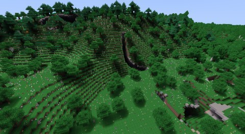

# Funny Shadows
Add sunlight shadows to your Minetest game.

The mod works by scanning the world in the view field of all connected players and patching 
the light information embedded into the map to produce realistic-looking tilted shadows of 
the world objects.

## Notes, limitations and known issues

The following limitations and considerations apply:

* As this is a pure LUA implementation, expect lag and high CPU load. 
  Your experience depends on the CPU speed of the server and the complexity of the terrain.
* Shadow information is written directly into the map and will be preserved even if the mod is removed.
  You can remove shadows around you by using `/fixlight here <radius>` command. You can also use tools in WorldEdit and  Terraform mods.
* Shadows are only cast by nodes and are blocky (made of nodes). Entities never cast shadows.
* There are only 15 levels of light from black to sunlight.
* Certain combinations of parameters produce afterglow when removing torches.
* Shadows are only recalculated when you see them, so different parts of the map may have 
  different shadows.
* Large seas and oceans will have noticeable difference between default and funny shadows due to
  the difference in light propagation algorithms.
* Shadows do not follow the sunlight continuously, but change every 1/2 to 1 hour of game time.
* Changing the confguration parameters will cause the shadows to be updated as you see them.
* **Important:** This mod technically supports multiplayer but has never been tested on
  multiplayer servers, experience may vary.

## Configuration

See [settingtypes.txt](settingtypes.txt) for a description of all parameters.

Here are some configuration scenarios and recommendations:

* When playing MineClone2 or similar games with primarily flat landscape, enable "Follow Sun" 
  `shadows.follow_sun` to use shadows as an indicator of the daytime on the surface.

* When playing games with Carpatian, v7 or other mapgens that produce large mountains, disable 
  "Follow Sun" `shadows.follow_sun` to have more consistent game experience.

* Set Bright tones decay factor `shadows.decay_factor_bright` to a value less than 0.7 to have shadows
  with higher contrast.

* Set Minimum light level `shadows.decay_minimum_light` to value 4 or higher to get constant ambient light in the caves.

* Increase Time budget `shadows.time_budget` to `800` or higher if your CPU allows to spend more time calculating shadows.
  Decrease the Time budget if you notice gameplay lag.

